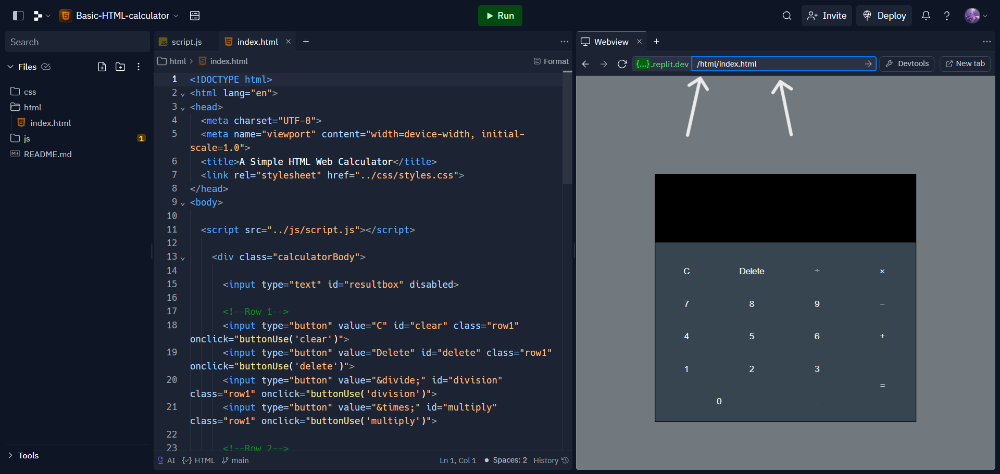
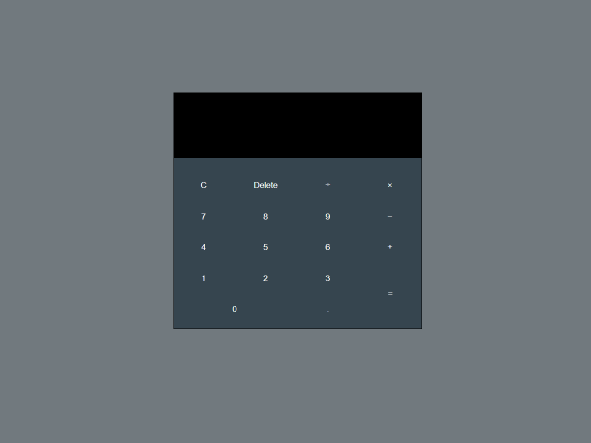

# Basic HTML-calculator
## A simple calculator made with HTML, CSS and JavaScript.

### Try on [Replit.com](https://replit.com/@Simpleboy353/Basic-HTML-calculator#html/index.html)

- To try on Replit.com, replace the link in the web preview sidebar.
- If the link is empty, add `/html/index.html` as the link.

### Here's a preview of how the calculator looks:

